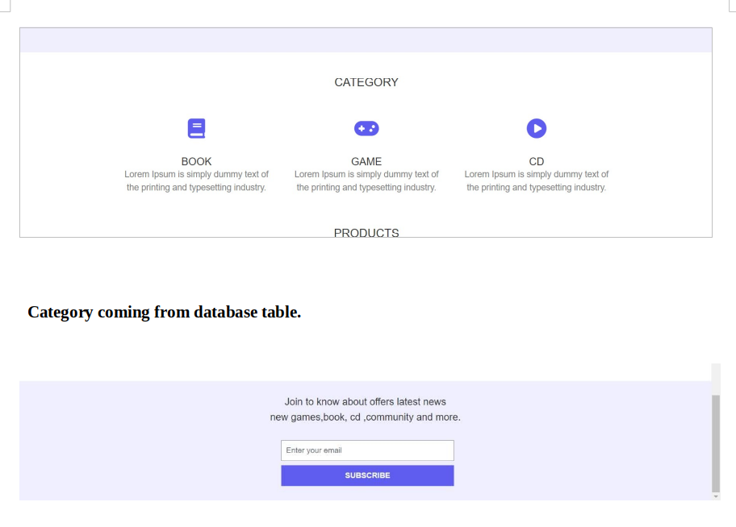

# Application Documentation

This documentation provides an in-depth overview of the key components and functionalities included in the application developed by Sushant Chapagain.

## Views

### Homepage Layout

### View Page

### Admin Dashboard

### Admin View

### Edit Product View

## Routes

The application includes various routes to navigate through different sections, including:

-   Showing Products in Homepage
-   Product Controller Routes (Create, Show, Edit, Delete)
-   Dashboard Controller Routes

## Laravel Breeze With Admin Middleware

By default, everyone is logged in as an admin in Laravel Breeze. A custom middleware has been created to prevent unauthorized access to admin functionality.

## Models

### User Model

Handles user data and authentication.

### Category Model

Manages product categories with a relation to the Product model.

### Product Model

Represents product information with category filtering.

## Controller

### ProductController

Manages CRUD operations for products, including create, store, show, edit, update, and delete methods.

### DashboardController

Handles actions related to the admin dashboard, including counting the total number of products and users in the database.

## Pagination

Pagination is implemented to enhance the user interface by dividing content into manageable pages.

## Mailchimp API Integration

The application integrates with the Mailchimp API for newsletter functionality, allowing users to subscribe and receive updates.

## CRUD Operations

The application supports CRUD (Create, Read, Update, Delete) operations for products.

## Number of Products and Users

The dashboard controller counts the total number of products and users in the database, providing valuable insights.

## MySQL Database

The application uses MySQL for efficient data storage and retrieval. Migration files create tables for products, categories, and users.

## Factory and Seeder

A factory and seeder are created to populate the database with sample data, facilitating testing and development.
